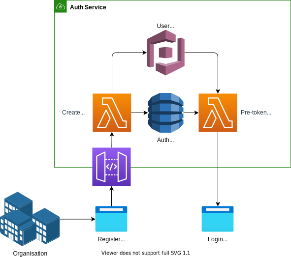
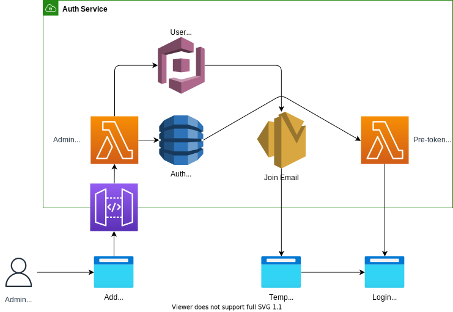
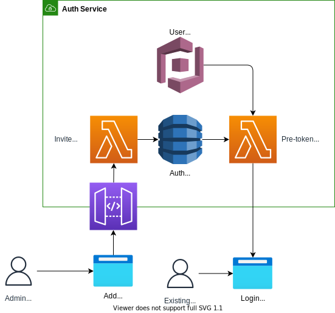

# Org Stack

Inspired by complex IAM and RBAC, multi-tenant to multi-org relationships.

- [Org Stack](#org-stack)
  - [Goals](#goals)
  - [Reading](#reading)
  - [Design](#design)
    - [Auth service](#auth-service)
      - [POST /organisation/create](#post-organisationcreate)
      - [POST /organisation/{}/user](#post-organisationuser)
        - [How to handle existing user at this stage?](#how-to-handle-existing-user-at-this-stage)
      - [PATCH /organisation/{}/user](#patch-organisationuser)

## Goals

- [ ] Create organisation flow which creates a default admin user as the person filling in the form
  - [ ] Admin user, and only the admin user, can add more users to the organisation
- [ ] An admin for an Organisation can add a user that already belongs to an organisation

## Reading

- Basics of RBAC with appsync and cognito: https://theburningmonk.com/2021/03/the-case-for-and-against-amazon-cognito/
- Advanced custom multi-tenant to multi-org: https://theburningmonk.com/2021/03/how-to-secure-multi-tenant-applications-with-appsync-and-cognito/
- Further group level controls for Cognito: https://theburningmonk.com/2021/09/group-based-auth-with-appsync-lambda-authoriser/

## Design

### Auth service

An authentication service should sit in front of a single cognito user pool.

The cognito user pool will store users login credentials.

Each user will belong to a parent organization `parent_org_id`, which is immutable, in the JWT claim.

The user would have a role, and those roles would need to be specific to each organisation, therefore using cognito groups would not be possible, as Admin role for the parent organisation, would override a readonly role for a child organisation.

| Role         | Description                                            |
| ------------ | ------------------------------------------------------ |
| Admin        | Can do everything and add new user to the organisation |
| User         | Can do everything in that organisation                 |
| ReadOnlyUser | Can read everything in that organisation               |

#### POST /organisation/create

Create an organisation and an admin user.

Store the `parent_org_id` in the JWT claims and put it into a dynamoDB record for `ORGANISATION`.

Redirect to sign-in on success.

#### POST /organisation/{}/user

Create a user inside the organisation with the chosen role.

##### How to handle existing user at this stage?

1. This user exists, invite them to join your organisation instead.

#### PATCH /organisation/{}/user

Add an existing user to the organisation.

This should create a token that suppresses claims for the other organisation.
